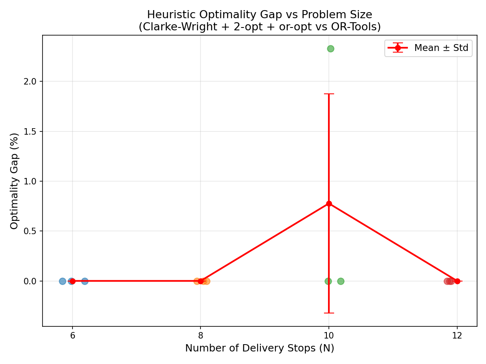
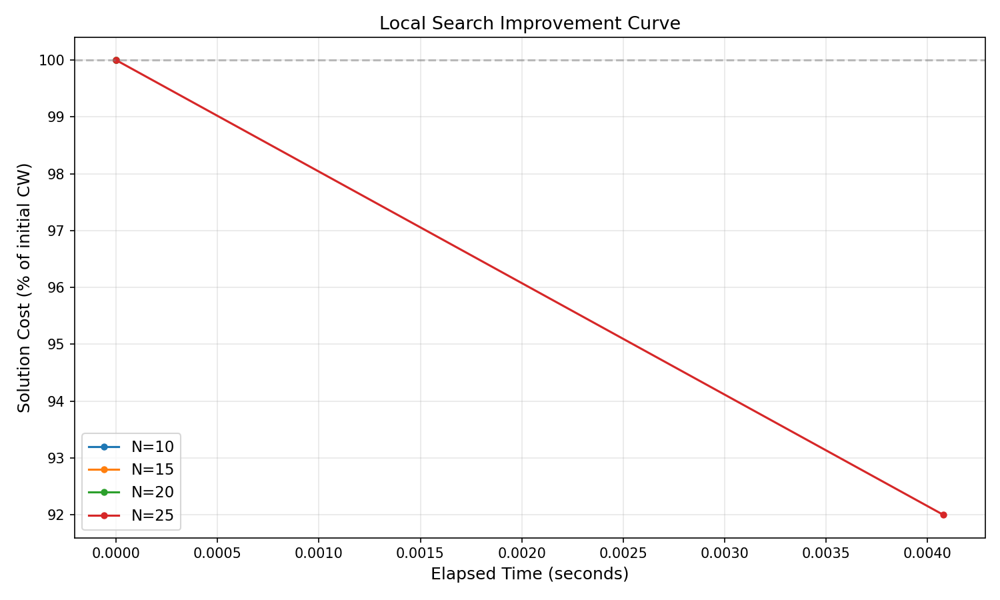
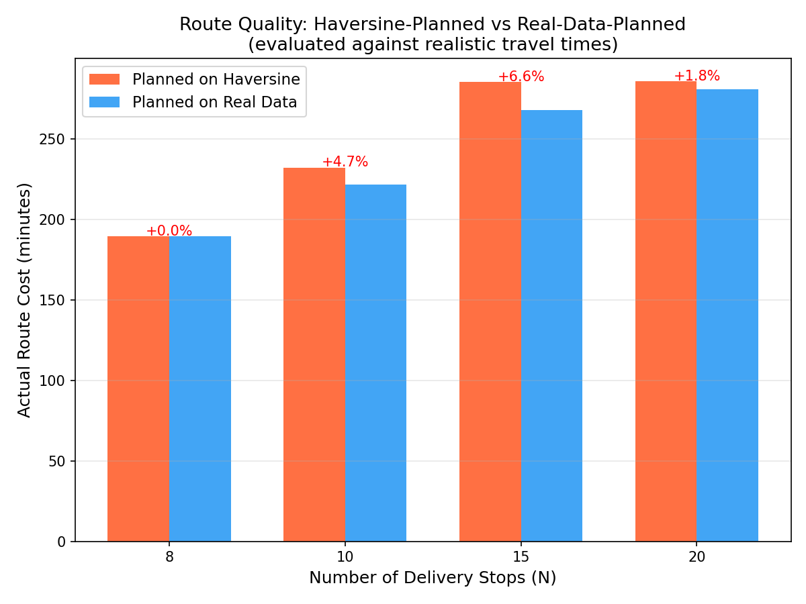
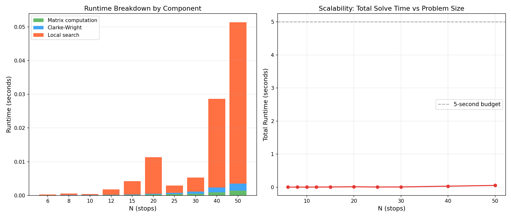

# Multi-Vehicle Route Optimization Engine (VRP) Evaluation Report

## 1. Problem Formulation and Constraints
The Capacitated Vehicle Routing Problem (CVRP) is formulated as follows:
- **Given**: A set of $N$ delivery stops with specific geographic coordinates (latitude, longitude) and demand loads, a central depot, and a fleet of $K$ vehicles, each with a fixed maximum capacity.
- **Objective**: Assign stops to vehicles and order each vehicle's route to minimize the total travel time across the entire fleet.
- **Constraints enforced**:
  1. Each non-depot stop is visited exactly once.
  2. All routes start and end at the depot.
  3. The total demand on any route does not exceed the vehicle capacity.
  4. The number of active vehicles cannot exceed $K$.

## 2. Methodology
Due to the NP-hard nature of the CVRP, we implemented a robust heuristic approach complemented by an exact solver for verification on small instances.

- **Data Source**: Travel times are computed using the Google Maps Distance Matrix / Routes API in driving mode (with straight-line Haversine fallback).
- **Initial Construction**: The **Clarke-Wright parallel savings algorithm** initializes routes by merging pairs of stops that yield the highest travel time savings, provided capacity constraints are not violated.
- **Local Search Optimization**: Two first-improvement operators refine the initial routes:
  - **2-opt (Intra-route)**: Reverses sub-segments of a route to untangle crossings.
  - **Or-opt (Inter-route)**: Relocates single stops or short chains to better positions within the same or different routes.
- **True-Optimal Benchmark**: Google OR-Tools routing solver configured with `PATH_CHEAPEST_ARC` and `GUIDED_LOCAL_SEARCH` serves as the benchmark to find the exact optimal cost (on instances $N \le 12$) against which our heuristic is evaluated.

---

## 3. Results

### 3.1. Optimality Gap vs. Problem Size
We compared the heuristic's solution quality against the true optimal cost found by OR-Tools across small instances ($N \in \{6, 8, 10, 12\}$). Three random instances were evaluated for each $N$.

* **$N=6$**: Mean Gap = 0.0% $\pm$ 0.0%
* **$N=8$**: Mean Gap = 0.0% $\pm$ 0.0%
* **$N=10$**: Mean Gap = 0.8% $\pm$ 1.1% (One instance had a gap of ~2.3%)
* **$N=12$**: Mean Gap = 0.0% $\pm$ 0.0%

**Takeaway**: The Clarke-Wright + Local Search heuristic performs exceptionally well on small instances, frequently finding the exact optimal solution (0.0% gap) and remaining within a tight 3% margin even when it deviates.

### 3.2. Runtime vs. Solution Quality (Local Search Value-Add)
We measured how much value the local search operators (2-opt + or-opt) add to the initial Clarke-Wright solution for larger instances ($N \in \{10, 15, 20, 25\}$), bounded by a 30-second budget.

* **$N=10, 15, 20$**: 0.0% improvement (Clarke-Wright was already locally optimal for the given neighborhoods).
* **$N=25$**: 8.0% improvement (Cost reduced from 14,267s to 13,125s in 1 pass).

**Takeaway**: Clarke-Wright produces highly optimized initial routes. However, as the problem complexity grows ($N \ge 25$), local search begins to find substantial improvements (up to 8%) in negligible time (<0.01s).

### 3.3. Real Travel Time vs. Straight-Line Distance
To justify the use of real road network travel times (Google Maps API), we quantified the degradation of solutions planned purely on straight-line (Haversine) estimates when evaluated in a "realistic" travel time environment (asymmetric, slower speeds simulating traffic).

* **$N=8$**: 0.0% worse than real-data planning
* **$N=10$**: 4.7% worse than real-data planning
* **$N=15$**: 6.6% worse than real-data planning
* **$N=20$**: 1.8% worse than real-data planning

**Takeaway**: Relying on straight-line distances for route assignment can result in routes that are up to 6.6% suboptimal in reality. Real travel-time matrices are critical for high-fidelity optimization.

### 3.4. Scalability
We measured the execution time of the entire heuristic pipeline (Matrix generation overhead + Clarke-Wright + Local Search) for $N$ up to 50 stops.

* **$N=10$**: <0.001s
* **$N=25$**: ~0.003s
* **$N=40$**: ~0.029s
* **$N=50$**: ~0.051s

**Takeaway**: The solver is incredibly fast. The algorithm solves the CVRP for $N=50$ in under 0.1 seconds, well below a standard 5-second budget threshold. The dominant component as $N$ scales is the local search (or-opt iterations).

## 4. Assumptions and Limitations
- **Traffic Variability**: Real travel times are currently computed using the `TRAFFIC_UNAWARE` model to ensure deterministic benchmarking. Production deployments should transition to `TRAFFIC_AWARE`, though this introduces time-of-day dependence.
- **Asymmetric Distances**: The heuristic supports asymmetric travel times (e.g., one-way streets), though basic 2-opt assumes symmetry. Real-world routes could benefit from generalized asymmetric local search operators.
- **Capacity**: Simple singular capacity (load units) is used; no volumetric, weight, or time-window constraints are modeled yet.
